# Практика 2. Rest Service

## Программирование. Rest Service. Часть I

### Задание А (3 балла)
Создайте простой REST сервис, в котором используются HTTP операции GET, POST, PUT и DELETE.
Предположим, что это сервис для будущего интернет-магазина, который пока что умеет 
работать только со списком продуктов. У каждого продукта есть поля: `id` (уникальный идентификатор),
`name` и `description`. 

Таким образом, json-схема продукта (обозначим её `<product-json>`):

```json
{
  "id": 0,
  "name": "string",
  "description": "string"
}
```

Данные продукта от клиента к серверу должны слаться в теле запроса в виде json-а, **не** в параметрах запроса.

Ваш сервис должен поддерживать следующие операции:
1. Добавить новый продукт. При этом его `id` должен сгенерироваться автоматически
   - `POST /product`
   - Схема запроса:
     ```json
     {
       "name": "string",
       "description": "string"
     }
     ```
   - Схема ответа: `<product-json>` (созданный продукт)
2. Получить продукт по его id
   - `GET /product/{product_id}`
   - Схема ответа: `<product-json>`
3. Обновить существующий продукт (обновляются только те поля продукта, которые были переданы в теле запроса)
   - `PUT /product/{product_id}`
   - Схема запроса: `<product-json>` (некоторые поля могут быть опущены)
   - Схема ответа: `<product-json>` (обновлённый продукт)
4. Удалить продукт по его id
   - `DELETE /product/{product_id}`
   - Схема ответа: `<product-json>` (удалённый продукт)
5. Получить список всех продуктов 
   - `GET /products`  
   - Схема ответа:
     ```
     [ 
       <product-json-1>,
       <product-json-2>, 
       ... 
     ]
     ```

Предусмотрите возвращение ошибок (например, если запрашиваемого продукта не существует).

Вы можете положить код сервиса в отдельную директорию рядом с этим документом.

### Задание Б (3 балла)
Продемонстрируйте работоспособность сервиса с помощью программы Postman
(https://www.postman.com/downloads) и приложите соответствующие скрины, на которых указаны
запросы и ответы со стороны сервиса для **всех** его операций.

#### Демонстрация работы
- POST запрос — 201 Created
    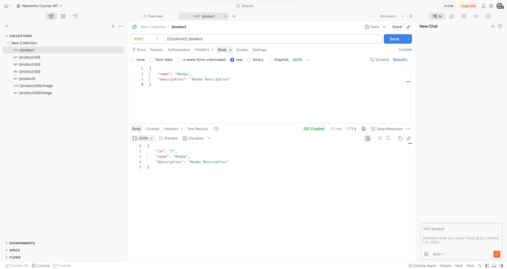
- POST запрос — 201 Created
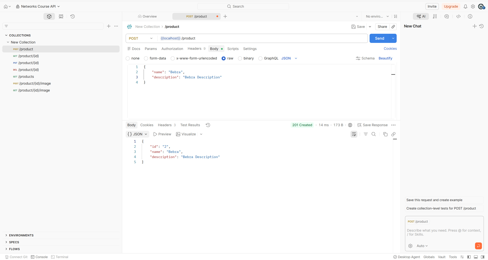
- GET запрос — 200 OK
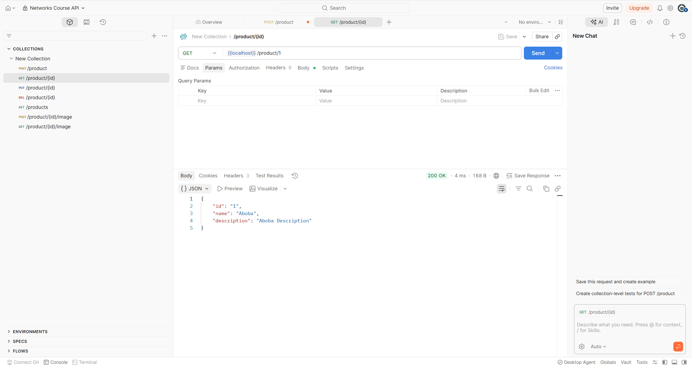
- GET запрос — 400 Bad Request (invalid id)
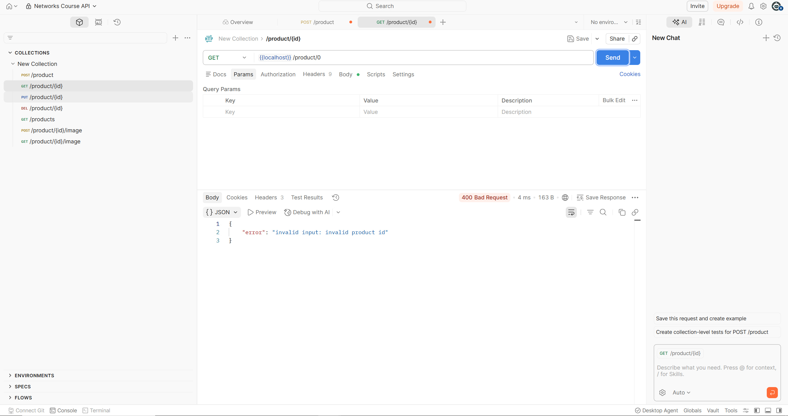
- GET запрос — 404 Not Found (product not found)
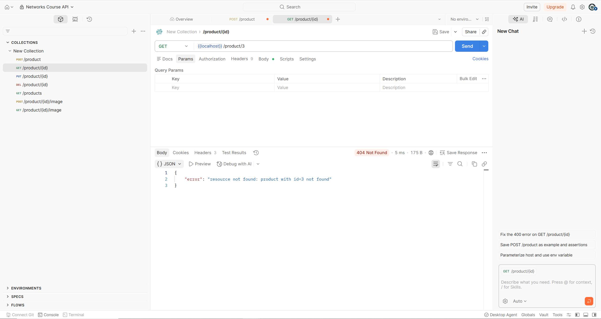
- PUT запрос — 200 OK
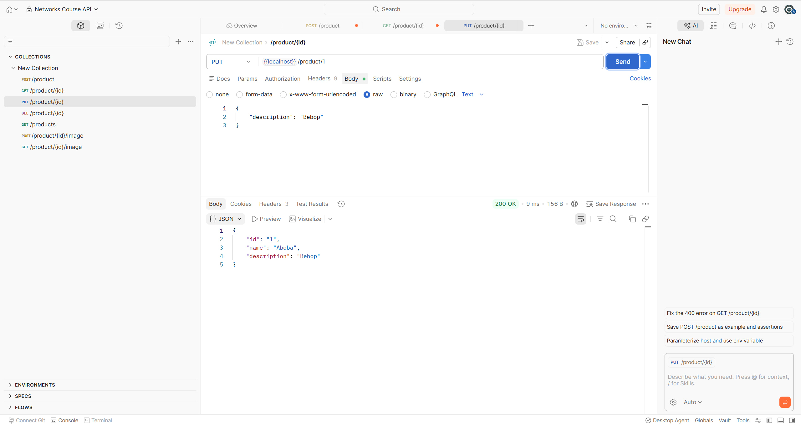
- GET запрос — 200 OK (updated product)
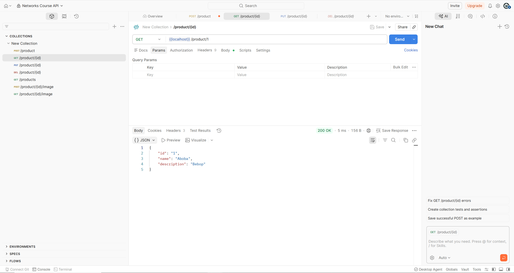
- DELETE запрос — 200 OK
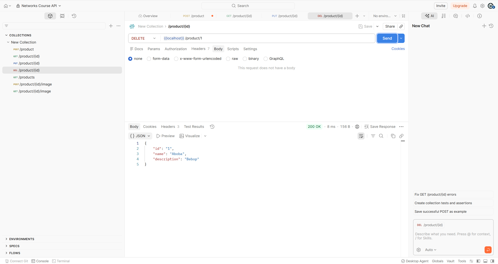
- GET запрос — 200 OK (only one product left)
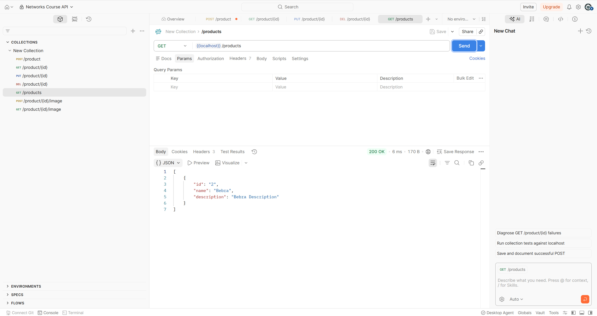

### Задание В (4 балла)
Пусть ваш продукт также имеет иконку (небольшую картинку). Формат иконки (картинки) может
быть любым на ваш выбор. Для простоты будем считать, что у каждого продукта картинка одна.

Добавьте две новые операции:
1. Загрузить иконку:
   - `POST product/{product_id}/image`
   - Запрос содержит бинарный файл — изображение  
     
2. Получить иконку:
   - `GET product/{product_id}/image`
   - В ответе передаётся только сама иконка  
     

Измените операции в Задании А так, чтобы теперь схема продукта содержала сведения о загруженной иконке, например, имя файла или путь:
```json
"icon": "string"
```

#### Демонстрация работы
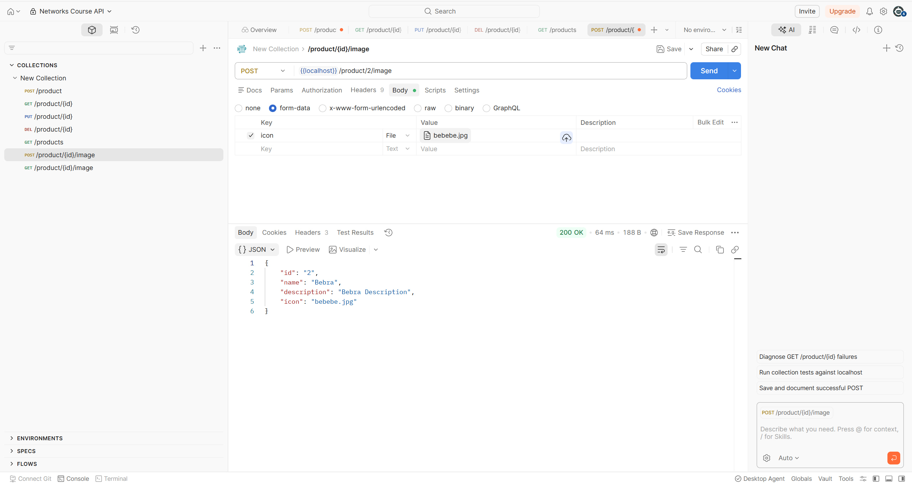
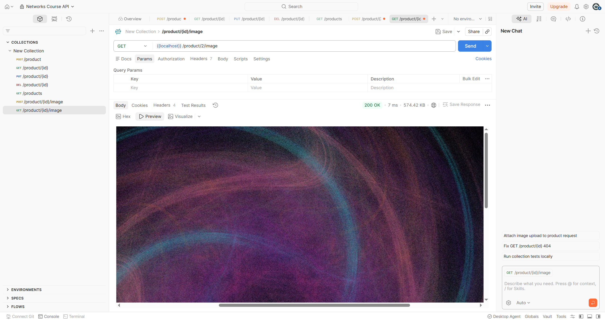

---

_(*) В последующих домашних заданиях вам будет предложено расширить функционал данного сервиса._

## Задачи

### Задача 1 (2 балла)
Общая (сквозная) задержка прохождения для одного пакета от источника к приемнику по пути,
состоящему из $N$ соединений, имеющих каждый скорость $R$ (то есть между источником и
приемником $N - 1$ маршрутизатор), равна $d_{\text{сквозная}} = N \dfrac{L}{R}$
Обобщите данную формулу для случая пересылки количества пакетов, равного $P$.

#### Решение
1. При первом соединении каждый пакет должен дождаться отправки всех пакетов, которые стоят раньше него
2. На каждом последующем таких ожиданий не будет, так как все соединения имеют одинаковую скорость, причем отправляются из системы по одному с интервалом $\dfrac{L}{R}$.
3. Итого получаем, что задержка последнего пакета = общая задержка = $N \cdot \dfrac{L}{R} + (P - 1) \cdot \dfrac{L}{R} = (N + P - 1) \cdot \dfrac{L}{R}$
#### Ответ: $(N + P - 1) \cdot \dfrac{L}{R}$

### Задача 2 (2 балла)
Допустим, мы хотим коммутацией пакетов отправить файл с хоста A на хост Б. Между хостами установлены три
последовательных канала соединения со следующими скоростями передачи данных:
$R_1 = 200$ Кбит/с, $R_2 = 3$ Мбит/с и $R_3 = 2$ Мбит/с.
Сколько времени приблизительно займет передача на хост Б файла размером $5$ мегабайт?
Как это время зависит от размера пакета?

#### Решение
1. Общая скорость передачи данных равна наименьшой из скоростей каждого канала, то есть $R_{\text{min}}=200 \text{ Кбит/c.} = 0.2 \text{ Мбит/с.}$ 
2. размер файла (в битах): $X = 5 \cdot 8 = 40 \text{ Мбит}$ 
3. Тогда время передачи равно $\dfrac{X}{R_{\text{min}}} = \dfrac{40\text{ Мбит}}{0.2\text{ Мбит/с.}} = 200 \text{ с.}$
#### Ответ: $200 \text{ с.}$

### Задача 3 (2 балла)
Предположим, что пользователи делят канал с пропускной способностью $2$ Мбит/с. Каждому
пользователю для передачи данных необходима скорость $100$ Кбит/с, но передает он данные
только в течение $20$ процентов времени использования канала. Предположим, что в сети всего $60$
пользователей. А также предполагается, что используется сеть с коммутацией пакетов. Найдите
вероятность одновременной передачи данных $12$ или более пользователями.

#### Решение
1. Пусть $X$ -- число одновременно передающих пользователей. Заметим, что $X\sim \text{Bin}(n=60,p=0.2)$
2. Мы хотим посчитать, чем равна вероятность $P(X \geq 12)$. Заметим, что $P(X \geq 12) = 1 - P(X < 12) = 1 - P(X \leq 11)$
3. $P(X \leq k) = \sum_{i=0}^{\lfloor k \rfloor}\binom{n}{i}p^i(1-p)^{n-i} \Rightarrow P(X \leq 11) = \sum_{i=0}^{11}\binom{60}{i}\cdot0.2^i\cdot0.8^{60-i}\approx0.4486$
#### Ответ: $P(X \geq 12) = 1 - P(X \leq 11) \approx 1 - 0.4486 = 0.5514$

### Задача 4 (2 балла)
Пусть файл размером $X$ бит отправляется с хоста А на хост Б, между которыми три линии связи и
два коммутатора. Хост А разбивает файл на сегменты по $S$ бит каждый и добавляет к ним
заголовки размером $80$ бит, формируя тем самым пакеты длиной $L = 80 + S$ бит. Скорость
передачи данных по каждой линии составляет $R$ бит/с. Загрузка линий мала, и очередей пакетов
нет. При каком значении $S$ задержка передачи файла между хостами А и Б будет минимальной?
Задержкой распространения сигнала пренебречь.

#### Решение
1. Файл разбивается на сегменты по $S$ бит, то есть $L = 80 +S$. \
    Кол-во пакетов: $P = \dfrac{X}{S}$. \
    $N=3$.
2. Подставим значения в формулу из Задачи 1: $d_{\text{сквозная}} = (N + P - 1) \cdot \dfrac{L}{R} = (3 + \dfrac{X}{S} - 1) \cdot \dfrac{80 + S}{R} = (2 + \dfrac{X}{S}) \cdot \dfrac{80 + S}{R}$
3. Теперь нужно минимизировать это значение. Для этого приравняем производную к нулю: \
    $d'_{\text{сквозная}} = \dfrac{1}{R} \cdot \left( -\dfrac{X \cdot (80 + S)}{S^2} + 2 + \dfrac{X}{S} \right) = 0$ \
    $\Rightarrow -\dfrac{X \cdot (80 + S)}{S^2} + 2 + \dfrac{X}{S} = 0$ \
    $\Rightarrow -\dfrac{80X}{S^2} + 2 = 0$ \
    $\Rightarrow S^2 = 40X$ \
    $\Rightarrow S = \sqrt{40X}$
#### Ответ: $S = \sqrt{40X}$

### Задание 5 (2 балла)
Рассмотрим задержку ожидания в буфере маршрутизатора. Обозначим через $I$ интенсивность
трафика, то есть $I = \dfrac{L a}{R}$.
Предположим, что для $I < 1$ задержка ожидания вычисляется как $\dfrac{I \cdot L}{R (1 – I)}$. 
1. Напишите формулу для общей задержки, то есть суммы задержек ожидания и передачи.
2. Опишите зависимость величины общей задержки от значения $\dfrac{L}{R}$.

#### Решение
1. 1. Задержка передачи: $\dfrac{L}{R}$. \
    Задержка ожидания: $\dfrac{I \cdot L}{R (1 – I)}$\
    **Общая задержка:** $d_{\text{общая}} = \dfrac{L}{R} + \dfrac{I \cdot L}{R (1 – I)} = \dfrac{L}{R}\cdot(1+\dfrac{I}{1-I}) =  \dfrac{L}{R}\cdot\dfrac{1}{1-I}$.
2. 1. Уменьшение $\dfrac{L}{R}$ снижает задержку, пока $\dfrac{L}{R} \ll \dfrac{1}{a}$
   2. При $I \to 1$ задержка резко возрастает и стремится к бесконечности, т.е. когда $\dfrac{L}{R} \to \dfrac{1}{a}$

