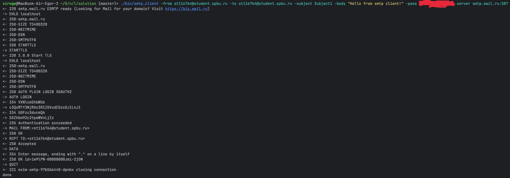
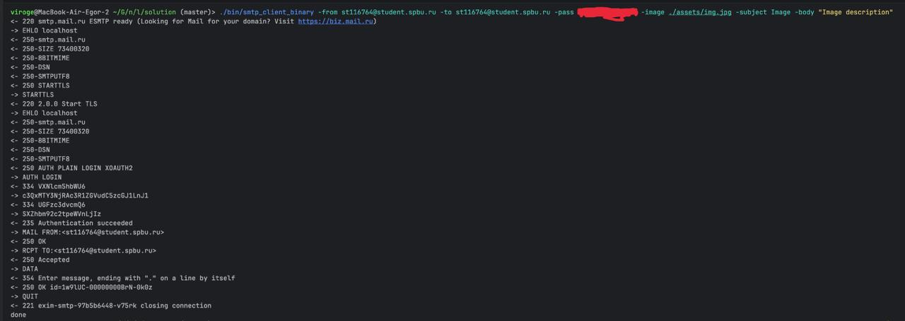
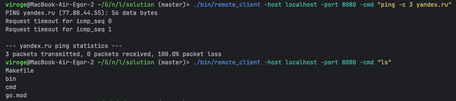
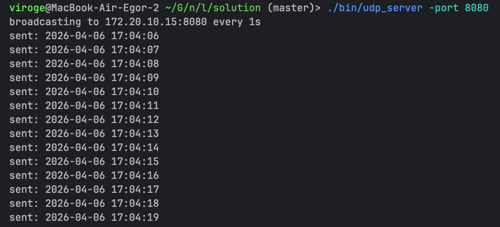
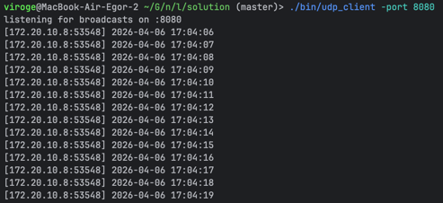
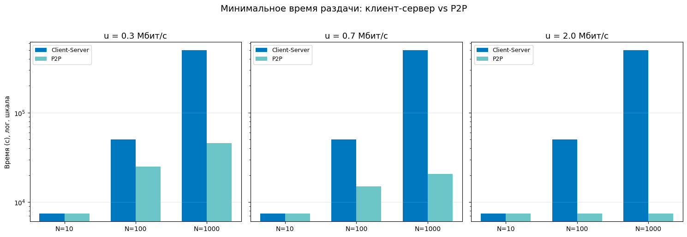

# Практика 5. Прикладной уровень

## Программирование сокетов.

### A. Почта и SMTP (7 баллов)

### 1. Почтовый клиент (2 балла)
Напишите программу для отправки электронной почты получателю, адрес
которого задается параметром. Адрес отправителя может быть постоянным. Программа
должна поддерживать два формата сообщений: **txt** и **html**. Используйте готовые
библиотеки для работы с почтой, т.е. в этом задании **не** предполагается общение с smtp
сервером через сокеты напрямую.

Приложите скриншоты полученных сообщений (для обоих форматов).

#### Демонстрация работы

```
./bin/mail_client -from st116764@student.spbu.ru -to st116764@student.spbu.ru -format txt -subject Aboba -body "Hello from mail client!" -pass ********
``` 
- 
```
./bin/mail_client -from st116764@student.spbu.ru -to st116764@student.spbu.ru -format html -subject Bebra -body "<h1>HTML!</h1><p>Здесь могла быть ваша реклама</p>" -pass ********
```
- 

### 2. SMTP-клиент (3 балла)
Разработайте простой почтовый клиент, который отправляет текстовые сообщения
электронной почты произвольному получателю. Программа должна соединиться с
почтовым сервером, используя протокол SMTP, и передать ему сообщение.
Не используйте встроенные методы для отправки почты, которые есть в большинстве
современных платформ. Вместо этого реализуйте свое решение на сокетах с передачей
сообщений почтовому серверу.

Сделайте скриншоты полученных сообщений.

#### Демонстрация работы
- 
- 

### 3. SMTP-клиент: бинарные данные (2 балла)
Модифицируйте ваш SMTP-клиент из предыдущего задания так, чтобы теперь он мог
отправлять письма с изображениями (бинарными данными).

Сделайте скриншот, подтверждающий получение почтового сообщения с картинкой.

#### Демонстрация работы
- 
- 

---

_Многие почтовые серверы используют ssl, что может вызвать трудности при работе с ними из
ваших приложений. Можете использовать для тестов smtp сервер СПбГУ: mail.spbu.ru, 25_

### Б. Удаленный запуск команд (3 балла)
Напишите программу для запуска команд (или приложений) на удаленном хосте с помощью TCP сокетов.

Например, вы можете с клиента дать команду серверу запустить приложение Калькулятор или
Paint (на стороне сервера). Или запустить консольное приложение/утилиту с указанными
параметрами. Однако запущенное приложение **должно** выводить какую-либо информацию на
консоль или передавать свой статус после запуска, который должен быть отправлен обратно
клиенту. Продемонстрируйте работу вашей программы, приложив скриншот.

Например, удаленно запускается команда `ping yandex.ru`. Результат этой команды (запущенной на
сервере) отправляется обратно клиенту.

#### Демонстрация работы
- Сервер<br>
  - 
- Клиент<br>
   - 

### В. Широковещательная рассылка через UDP (2 балла)
Реализуйте сервер (веб-службу) и клиента с использованием интерфейса Socket API, которая:
- работает по протоколу UDP
- каждую секунду рассылает широковещательно всем клиентам свое текущее время
- клиент службы выводит на консоль сообщаемое ему время

#### Демонстрация работы
- Сервер<br>
   - 
- Клиент<br>
   - 


## Задачи

### Задача 1 (2 балла)
Рассмотрим короткую, $10$-метровую линию связи, по которой отправитель может передавать
данные со скоростью $150$ бит/с в обоих направлениях. Предположим, что пакеты, содержащие
данные, имеют размер $100000$ бит, а пакеты, содержащие только управляющую информацию
(например, флаг подтверждения или информацию рукопожатия) – $200$ бит. Предположим, что у
нас $10$ параллельных соединений, и каждому предоставлено $1/10$ полосы пропускания канала
связи. Также допустим, что используется протокол HTTP, и предположим, что каждый
загруженный объект имеет размер $100$ Кбит, и что исходный объект содержит $10$ ссылок на другие
объекты того же отправителя. Будем считать, что скорость распространения сигнала равна
скорости света ($300 \cdot 10^6$ м/с).
1. Вычислите общее время, необходимое для получения всех объектов при параллельных
непостоянных HTTP-соединениях
2. Вычислите общее время для постоянных HTTP-соединений. Ожидается ли существенное
преимущество по сравнению со случаем непостоянного соединения?

#### Решение
$d_{\text{передачи}} = \dfrac{L}{R} = \dfrac{100000 \text{ бит}}{150 \text{ бит/с}} = 666.667 \text{ с}$

$d_{\text{распространения}} = \dfrac{d}{v_\text{света}} = \dfrac{10 \text{ м}}{300 \cdot 10^6 \text{ м/с}} = 3.33 \cdot 10^{-8} \text{ с}= 33.3 \text{ нс}$

$T = \dfrac{200 \text{ бит}}{150 \text{ бит/с}} = 1.33 \text{ с}$

#### 1. параллельных непостоянных HTTP-соединениях
1. <br>Запрос первого объекта (TCP-рукопожатие + запрос + ответ):
$\underbrace{3\cdot(T + d_{\text{распр}})}_{\text{SYN+SYN-ACK+GET}} + (d_{\text{пер}} + d_{\text{распр}}) \approx 670.657$ с

2. <br>$10$ соединений, каждое получает $R/10 = 15$ бит/с.<br>
  $\underbrace{3\cdot(T\cdot 10 + d_{\text{распр}})}_{\text{SYN+SYN-ACK+GET}} + (d_{\text{пер}}\cdot 10 + d_{\text{распр}}) \approx 6706.57$ с
3. <br>Итого: $6706.57 + 670.657 = 7377.2$ с

#### 2. постоянных HTTP-соединений
1. <br>Запрос первого объека остается точно такой же:<br>
   $3\cdot(T + d_{\text{распр}}) + (d_{\text{пер}} + d_{\text{распр}}) \approx 670.657$ с
2. <br>10 объектов последовательно (TCP уже установлен):<br>
   $10\cdot(T + d_{\text{распр}} + d_{\text{пер}} + d_{\text{распр}}) \approx 6679.97$ c
3. <br>Итого: $670.657 + 6679.97 = 7350.627$ с

#### 3. Разница
- Абс: $T_\text{непост}-T_\text{пост} = 7377.2 - 7350.627 = 26.573$ с
- Отн: $\frac{T_\text{непост}}{T_\text{пост}} - 1= \dfrac{7377.2}{7350.627} - 1 \approx 0.00362  = 0.363$%

Получается что различие хоть и есть, но оно не дает существенного преимущества  

### Задача 2 (3 балла)
Рассмотрим раздачу файла размером $F = 15$ Гбит $N$ пирам. Сервер имеет скорость отдачи $u_s = 30$
Мбит/с, а каждый узел имеет скорость загрузки $d_i = 2$ Мбит/с и скорость отдачи $u$. Для $N = 10$, $100$
и $1000$ и для $u = 300$ Кбит/с, $700$ Кбит/с и $2$ Мбит/с подготовьте график минимального времени
раздачи для всех сочетаний $N$ и $u$ для вариантов клиент-серверной и одноранговой раздачи.

#### Решение


### Задача 3 (3 балла)
Рассмотрим клиент-серверную раздачу файла размером $F$ бит $N$ пирам, при которой сервер
способен отдавать одновременно данные множеству пиров – каждому с различной скоростью,
но общая скорость отдачи при этом не превышает значения $u_s$. Схема раздачи непрерывная.
1. Предположим, что $\dfrac{u_s}{N} \le d_{min}$.
   При какой схеме общее время раздачи будет составлять $\dfrac{N F}{u_s}$?
2. Предположим, что $\dfrac{u_s}{N} \ge d_{min}$. 
   При какой схеме общее время раздачи будет составлять  $\dfrac{F}{d_{min}}$?
3. Докажите, что минимальное время раздачи описывается формулой $\max\left(\dfrac{N F}{u_s}, \dfrac{F}{d_{min}}\right)$?

#### Решение
#### Случай $\dfrac{u_s}{N} \le d_{min}$:
- Если каждому пиру данные передаются со скоростью $d_i := \dfrac{u_s}{N}$, то, поскольку $\dfrac{u_s}{N} \le d_{min} \le d_i$, все пиры могут принимать данные с этой скоростью -- все успевают принимать.<br>
- Полный объем данных $F$ передается каждому пиру за время $D = \dfrac{F}{d_i} = \dfrac{F\cdot N}{u_s}$ <br>
- Таким образом общее время раздачи составляет $\dfrac{F\cdot N}{u_s}$ <br>
#### Случай $\dfrac{u_s}{N} \ge d_{min}$:
- Если сервер каждому пиру передает данные со скоростью $d_{min}$, то сервер может эти данные раздавать со скоростью $N \cdot d_{min} \le u_s$ <br>
- Минимальная скорость загрузки среди всех пиров равна $d_{min}$, а значит, каждый пир получит все данные за время: $D = \dfrac{F}{d_{min}}$
#### Доказательство минимального времени раздачи:
- Очевидно, что:
  - сервер должен передать суммарно $N\cdot F$ бит (по $F$ каждому пиру) со скоростью не выше $u_s$, поэтому $D \geq \dfrac{N \cdot F}{u_s}$
  - самый медленный пир принимает $F$ бит со скоростью $d_{min}$, поэтому $D \geq \dfrac{F}{d_{\min}}$.
- Тогда $D = \max\left(\dfrac{N F}{u_s}, \dfrac{F}{d_{min}}\right)$
- Теперь покажем, что можно этого времени достичь:
  - если $\dfrac{u_s}{N} \le d_{min}$, то по 1-му пункту раздача возможна за $\dfrac{N\cdot F}{u_s}$, и в этом случае $\max\left(\dfrac{N F}{u_s}, \dfrac{F}{d_{min}}\right) = \dfrac{N\cdot F}{u_s}$
  - если $\dfrac{u_s}{N} \ge d_{min}$, то по 2-му пункту раздача возможна за $\dfrac{F}{d_{min}}$, и в этом случае $\max\left(\dfrac{N F}{u_s}, \dfrac{F}{d_{min}}\right) = \dfrac{F}{d_{min}}$
- Таким образом, мин время раздачи действительно описывается формулой: $\max\left(\dfrac{N F}{u_s}, \dfrac{F}{d_{min}}\right)$.