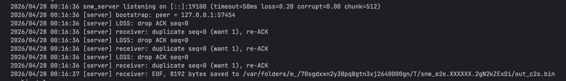
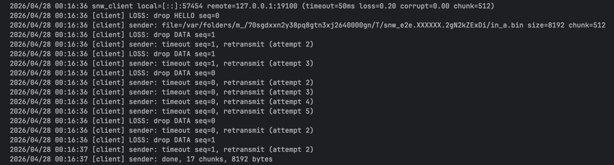
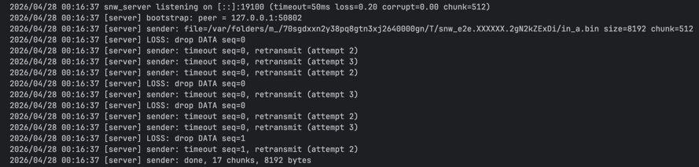
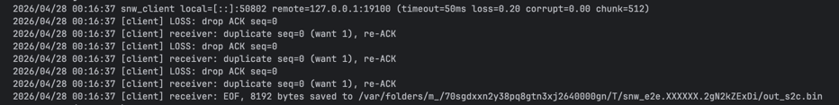
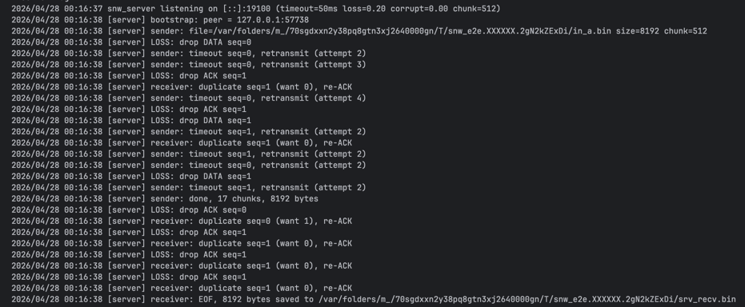
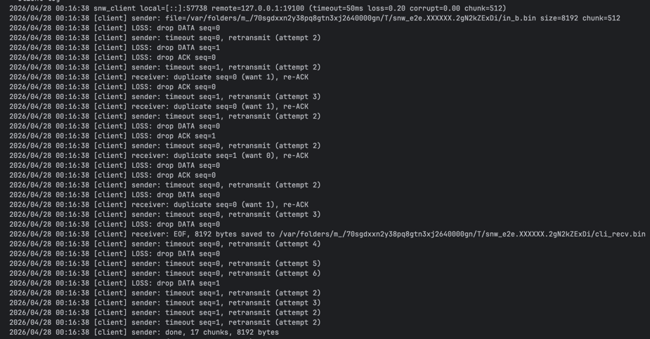
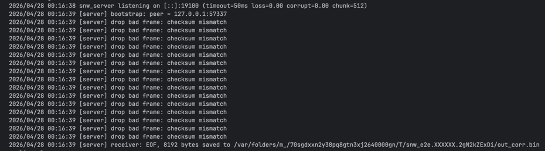
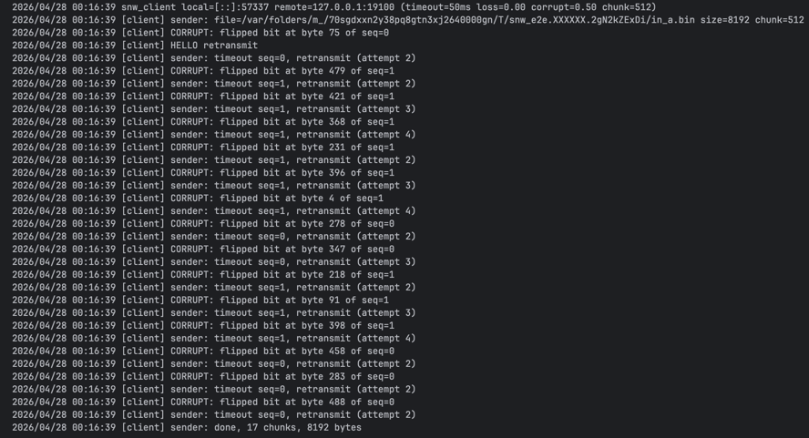

# Практика 8. Транспортный уровень

## Реализация протокола Stop and Wait (8 баллов)
Реализуйте свой протокол надежной передачи данных типа Stop and Wait на основе ненадежного
транспортного протокола UDP. В вашем протоколе, реализованном на прикладном уровне,
отправитель отправляет пакет (frame) с данными, а затем ожидает подтверждения перед
продолжением.

**Клиент**
- отправляет пакет и ожидает подтверждение ACK от сервера в течение заданного времени (тайм-аута)
- если ACK не получен, пакет отправляется снова
- все пакеты имеют номер (0 или 1) на случай, если один из них потерян

**Сервер**
- ожидает пакеты, отправляет ACK, когда пакет получен
- отправленный ACK должен иметь тот же номер, что и полученный пакет

Вы можете использовать схему, которая была рассмотрена на лекции в рамках обсуждения
протокола rdt3.0, как пример:

### А. Общие требования (5 баллов)
- В качестве базового протокола используйте UDP. Поддержите имитацию 30% потери
  пакетов. Потеря может происходить в обоих направлениях (от клиента серверу и от
  сервера клиенту).
- Должен быть поддержан настраиваемый таймаут.
- Должна быть обработка ошибок (как на сервере, так и на клиенте).
- В качестве демонстрации работоспособности вашего решения передайте через свой
  протокол файл (от клиента на сервер), разбив его на несколько пакетов перед отправкой
  на стороне клиента и собрав из отдельных пакетов в единый файл на стороне сервера.
  Файл и размеры пакетов выберите самостоятельно.

Приложите скриншоты, подтверждающие работоспособность программы.

#### Демонстрация работы
- Клиент $\rightarrow$ сервер
  -  
    - Сервер
  -  
    - Клиент

### Б. Дуплексная передача (2 балла)
Поддержите возможность пересылки данных в обоих направлениях: как от клиента к серверу, так и
наоборот. 

Продемонстрируйте передачу файла от сервера клиенту.

#### Демонстрация работы
- Клиент $\leftarrow$ сервер
  -  
    - Сервер
  -  
    - Клиент
- Клиент $\leftrightarrow$ сервер
  -  
    - Сервер
  -  
    - Клиент

### В. Контрольные суммы (1 балл)
UDP реализует механизм контрольных сумм при передаче данных. Однако предположим, что
этого нет. Реализуйте и интегрируйте в протокол свой способ проверки корректности данных
на прикладном уровне (для этого вы можете использовать результаты из следующего задания
«Контрольные суммы»).

## Контрольные суммы (2 балла)
Методы, основанные на использовании контрольных сумм, обрабатывают $d$ разрядов данных как
последовательность $k$-разрядных целых чисел.
Наиболее простой метод заключается в простом суммировании этих $k$-разрядных целых чисел и
использовании полученной суммы в качестве битов определения ошибок. Так работает алгоритм
вычисления контрольной суммы, принятый в Интернете, — байты данных группируются в $16$-
разрядные целые числа и суммируются. Затем от суммы берется обратное значение (дополнение
до $1$), которое и помещается в заголовок сегмента.

Получатель проверяет контрольную сумму, складывая все числа из данных (включая контрольную
сумму), и сравнивает результат с числом, все разряды которого равны $1$. Если хотя бы один из
разрядов результата равен $0$, это означает, что произошла ошибка.
В протоколах TCP и UDP контрольная сумма вычисляется по всем полям (включая поля заголовка и
данных).

Реализуйте функцию для подсчета контрольной суммы, а также функцию для проверки, что
данные соответствуют контрольной сумме.

**Требования**
- Функция 1 принимает на вход массив байт и возвращает контрольную сумму (число).
- Функция 2 принимает на вход массив байт и контрольную сумму и проверяет,
соответствует ли сумма переданным данным. Размер входного массива ограничен сверху
числом байтов ($= L$), однако данные могут поступать разной длины ($\le L$).

Добавьте два-три теста, покрывающих как случаи
корректной работы, так и случаи ошибки в данных (сбой битов). Вы можете не использовать
тестовые фреймворки и реализовать тестовые сценарии в консольном приложении.
- Восстановление с помощью контрольной суммы
  -  
    - Сервер
  -  
    - Клиент

## Задачи

### Задача 1 (2 балла)
Пусть $T$ (измеряется в RTT) обозначает интервал времени, который TCP-соединение тратит на
увеличение размера окна перегрузки с $\frac{W}{2}$ до $W$, где $W$ – это максимальный размер окна
перегрузки. Докажите, что $T$ – это функция от средней пропускной способности TCP.

#### Решение
1. Окно увеличивается на $1$ $\text{MSS}$ за каждый $\text{RTT}$.  
   Чтобы вырасти с $\dfrac{W}{2}$ до $W$, окно должно увеличиться на $\dfrac{W}{2}$ сегментов, поэтому $T = \dfrac{W}{2}$ $(1)$
2. В установившемся режиме окно линейно растёт от $\dfrac{W}{2}$ до $W$, потом сразу падает обратно до $\dfrac{W}{2}$ при потере. 
   Середина равномерного линейного подъёма от $\dfrac{W}{2}$ до $W$ равна $\dfrac{3W}{4}$ 
  Обозначим среднее число сегментов за $\text{RTT}$: $\overline{N} := \dfrac{3W}{4}$ 
3. Тогда средняя пропускная способность TCP: $A := \dfrac{\overline{N}\cdot\text{MSS}}{\text{RTT}} = \dfrac{3W}{4}\cdot\dfrac{\text{MSS}}{\text{RTT}}$
4. Отсюда $W = \dfrac{4A}{3}\cdot\dfrac{\text{RTT}}{\text{MSS}}$
5. Подставляем в $(1)$: $T = \dfrac{2}{3}\cdot\dfrac{A\cdot\text{RTT}}{\text{MSS}}$

Таким образом получается, что $T$ выражается через $A$ (среднюю пропускную способность TCP). $\blacksquare$

### Задача 2 (3 балла)
Рассмотрим задержку, полученную в фазе медленного старта TCP. Рассмотрим клиент и веб-сервер, напрямую соединенные одним каналом со скоростью передачи данных $R$.
Предположим, клиент хочет получить от сервера объект, размер которого точно равен $15 \cdot S$,
где $S$ – это максимальный размер сегмента.
Игнорируя заголовки протокола, определите время извлечения объекта (общее время
задержки), включая время на установление TCP-соединения (предполагается, что RTT - константа), если:
1. $\dfrac{4S}{R} > \dfrac{S}{R} + RTT > \dfrac{2S}{R}$
2. $\dfrac{𝑆}{𝑅} + 𝑅𝑇𝑇 > \dfrac{4𝑆}{𝑅}$
3. $\dfrac{𝑆}{𝑅} > 𝑅𝑇𝑇$

#### Решение
##### Случай $\dfrac{4S}{R} > \dfrac{S}{R} + RTT > \dfrac{2S}{R}$:
1. Сначала необходимо учесть время на установление соединения и отправку первого запуска.  
Для этого потребуется $2 \cdot \text{RTT} + \dfrac{S}{R}$, то есть время на установление соединения и отправку первого запроса с получением первого сегмента данных. 
Далее пройдет $\text{RTT}$ между отправкой $\text{ACK}$ и получением нового сегмента данных, при этом окно увеличивается в $2$ раза. 
Мы получаем первый сегмент из этого окна за $\dfrac{S}{R}$ и тратим $\text{RTT}$, чтобы отправить $\text{ACK}$ и получить первый байт нового окна, снова увеличившегося в $2$ раза
2. Следующий $\text{ACK}$, отправленный нами, придет во время отправки третьего окна, т.к. $\dfrac{4S}{R} > \dfrac{S}{R} + RTT$. Поэтому отправка снова увеличившегося в $2$ раза четвертого окна начинается сразу после третьего.
3. Значит общее время: $T = 2\cdot\text{RTT} + \dfrac{S}{R} + \text{RTT} + \dfrac{S}{R} + \text{RTT} + \dfrac{12S}{R} = 4\cdot\text{RTT} + \dfrac{14S}{R}$
##### Случай $\dfrac{𝑆}{𝑅} + 𝑅𝑇𝑇 > \dfrac{4𝑆}{𝑅}$:
1. В этом случае $\text{ACK}$ придет не во время отправки третьего окна, а уже после её завершения, т.к. $\dfrac{𝑆}{𝑅} + 𝑅𝑇𝑇 > \dfrac{4𝑆}{𝑅}$
2. Значит общее время станет: $T = 2\cdot\text{RTT} + \dfrac{S}{R} + \text{RTT} + \dfrac{S}{R} + \text{RTT} + \dfrac{S}{R} + \text{RTT} + \dfrac{8S}{R} = 5\cdot\text{RTT} + \dfrac{11S}{R}$
##### Случай $\dfrac{𝑆}{𝑅} > 𝑅𝑇𝑇$:
1. В этом случае, т.к. $\dfrac{𝑆}{𝑅} > 𝑅𝑇𝑇$, уже для окна размера $2$ $\text{ACK}$ приходит во время отправки текущего окна. Окна идут подряд, как в конце первого пункта
2. Получаем общее время: $T = 2\cdot\text{RTT} + \dfrac{S}{R} + \text{RTT} + \dfrac{S}{R} + \dfrac{13S}{R} = 3\cdot\text{RTT} + \dfrac{15S}{R}$  

### Задача 3 (2 балла)
Рассмотрим модификацию алгоритма управления перегрузкой протокола TCP. Вместо
аддитивного увеличения, мы можем использовать мультипликативное увеличение. TCP-отправитель увеличивает размер своего окна в $(1 + a)$ раз (где $a$ - небольшая положительная
константа: $0 < a < 1$), как только получает верный ACK-пакет.
Найдите функциональную зависимость между частотой потерь $L$ и максимальным размером окна
перегрузки $W$. Утверждается, что для этого измененного протокола TCP, независимо от средней
пропускной способности TCP-соединения всегда требуется одинаковое количество времени для
увеличения размера окна перегрузки с $\frac{W}{2}$ до $W$.

#### Решение
1. Окно достигает размера $W$, когда $\dfrac{W}{2}(1+a)^n = W$, то есть $(1 + a)^n = 2 \Rightarrow n = \log_{1+a}2$ 
1. Общее кол-во сегментов $S = \dfrac{W}{2} + \dfrac{W}{2}(1 + a) + \dfrac{W}{2}(1 + a)^2 + \dfrac{W}{2}(1 + a)^3 + \dots + \dfrac{W}{2}(1 + a)^n$, где $n = \log_{1+a}2$
2. Таким образом, $S = \dfrac{W\cdot(2a + 1)}{2a}$
3. Значит частота потерь $L = \dfrac{1}{S} = \dfrac{2a}{W\cdot(2a+1)}$

### Задача 4. Расслоение TCP (2 балла)
Для облачных сервисов, таких как поисковые системы, электронная почта и социальные сети,
желательно обеспечить малое время отклика если конечная система расположена далеко от датацентра, то значение RTT будет большим, что может привести к неудовлетворительному времени
отклика, связанному с этапом медленного старта протокола TCP.
Рассмотрим задержку получения ответа на поисковый запрос. Обычно серверу требуется три окна
TCP на этапе медленного старта для доставки ответа. Таким образом, время с момента, когда
конечная система инициировала TCP-соединение, до времени, когда она получила последний
пакет в ответ, составляет примерно $4$ RTT (один RTT для установления TCP-соединения, плюс три
RTT для трех окон данных) плюс время обработки в дата-центре. Такие RTT задержки могут
привести к заметно замедленной выдаче результатов поиска для многих запросов. Более того,
могут присутствовать также и значительные потери пакетов в сетях доступа, приводящие к
повторной передаче TCP и еще большим задержкам.

Один из способов смягчения этой проблемы и улучшения восприятия пользователем
производительности заключается в том, чтобы:
- развернуть внешние серверы ближе к пользователям
- использовать расслоение TCP путем разделения TCP-соединения на внешнем сервере.
При расслоении клиент устанавливает TCP-соединение с ближайшим внешним сервером, который
поддерживает постоянное TCP-соединение с дата-центром с очень большим окном перегрузки TCP.

При использовании такого подхода время отклика примерно равно:
$$4 \cdot RTT_{FE} + RTT_{BE} + \text{ время обработки}~~~~~~~(1)$$
где $RTT_{FE}$ — время оборота между клиентом и внешним сервером, и $RTT_{BE}$ — время оборота
между внешним сервером и дата-центром (внутренним сервером). Если внешний сервер закрыт
для клиента, то это время ответа приближается к $RTT$ плюс время обработки, поскольку значение
$RTT_{FE}$ ничтожно мало и значение $RTT_{BE}$ приблизительно равно $RTT$. В итоге расслоение TCP
может уменьшить сетевую задержку, грубо говоря, с $4 \cdot RTT$ до $RTT$, значительно повышая
субъективную производительность, особенно для пользователей, которые расположены далеко
от ближайшего дата-центра.

Расслоение TCP также помогает сократить задержку повторной передачи TCP, вызванную
потерями в сетях.

Докажите утверждение $(1)$. 

#### Решение
1. Сначала тратится одно $RTT_{FE}$ на установление TCP-соединения между клиентом и ближайшим внешним сервером
2. Затем внешний сервер отправляет запрос к дата-центру, и этот путь туда-обратно занимает $RTT_{BE}$. 
Поскольку соединение между внешним сервером и дата-центром уже установлено и использует большое окно перегрузки TCP, ответ возвращается быстро и целиком в рамках одного окна
3. После этого внешний сервер пересылает данные клиенту. 
Поскольку передача происходит в фазе медленного старта, на это обычно уходит $3$ $\text{RTT}$ между клиентом и сервером, то есть $3\cdot RTT_{FE}$
4. В итоге общее время отклика составит: $RTT_{FE} + RTT_{BE} + 3\cdot RTT_{FE} + \text{время обработки} = 4\cdot RTT_{FE} + RTT_{BE} + \text{время обработки}$ $\blacksquare$