# Практика 9. Сетевой уровень

## Wireshark: ICMP
В лабораторной работе предлагается исследовать ряд аспектов протокола ICMP:
- ICMP-сообщения, генерируемые программой Ping
- ICMP-сообщения, генерируемые программой Traceroute
- Формат и содержимое ICMP-сообщения

### 1. Ping (4 балла)
Программа Ping на исходном хосте посылает пакет на целевой IP-адрес; если хост с этим адресом
активен, то программа Ping на нем откликается, отсылая ответный пакет хосту, инициировавшему
связь. Оба этих пакета Ping передаются по протоколу ICMP.

Выберите какой-либо хост, расположенный на другом континенте (например, в Америке или
Азии). Захватите с помощью Wireshark ICMP пакеты от утилиты ping.
Для этого из командной строки запустите команду (аргумент `-n 10` означает, что должно быть
отослано 10 ping-сообщений): `ping –n 10 host_name`

Для анализа пакетов в Wireshark введите строку icmp в области фильтрации вывода.

#### Вопросы
1. Каков IP-адрес вашего хоста? Каков IP-адрес хоста назначения?
   - 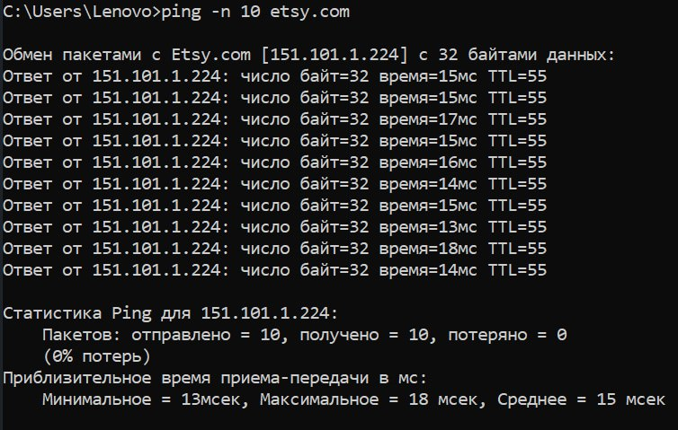 
   - 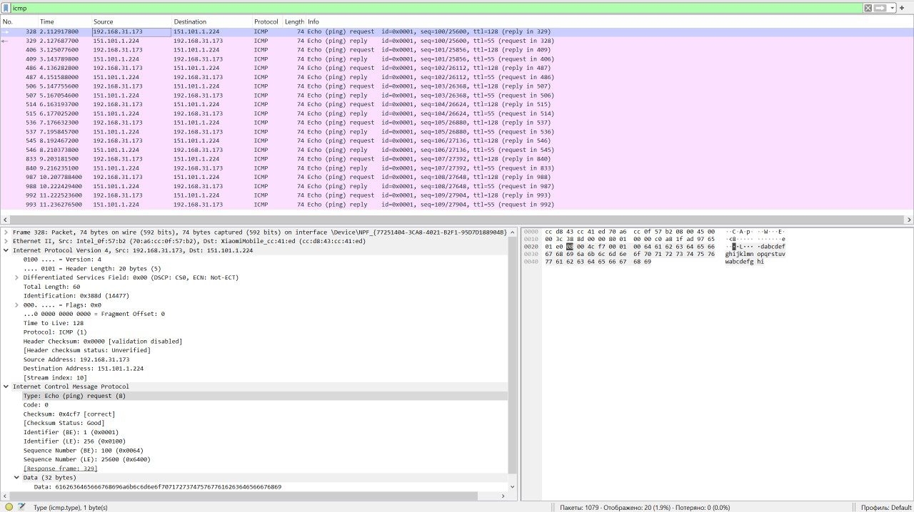 
     - Мой `192.168.31.173`
     - Хоста назначения `151.101.1.224`
2. Почему ICMP-пакет не обладает номерами исходного и конечного портов?
   - Потому что ICMP -- это протокол _сетевого_ уровня, а не _транспортного_, к которому относятся номера портов
3. Рассмотрите один из ping-запросов, отправленных вашим хостом. Каковы ICMP-тип и кодовый
   номер этого пакета? Какие еще поля есть в этом ICMP-пакете? Сколько байт приходится на поля 
   контрольной суммы, порядкового номера и идентификатора?
   - 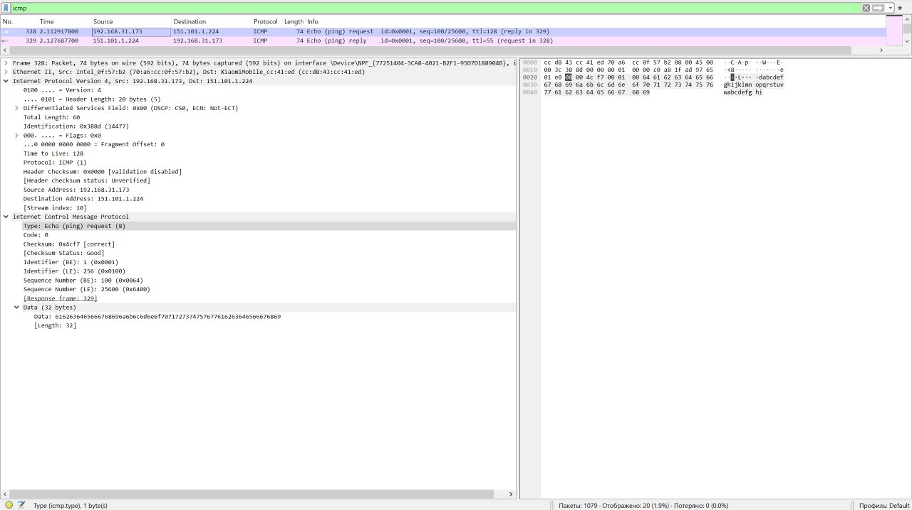 
     - `Type: Echo (ping) request (8)` - 1 байт
     - `Code: 0` - 1 байт
     - `Checksum: 0x4cf7 [correct]` - 2 байта
     - `Identifier (BE): 1 (0x0001)` - 2 байта
     - `Identifier (LE): 256 (0x0100)` 
     - `Sequence Number (BE): 24 (0x0018)` - 2 байта
     - `Sequence Number (LE): 6144 (0x1800)`
     - `Data (32 bytes)` - 32 байта 

     - Всего 40 байт
4. Рассмотрите соответствующий ping-пакет, полученный в ответ на предыдущий. 
   Каковы ICMP-тип и кодовый номер этого пакета? Какие еще поля есть в этом ICMP-пакете? 
   Сколько байт приходится на поля контрольной суммы, порядкового номера и идентификатора?
   -  
     - `Type: Echo (ping) reply (0)` - 1 байт
     - `Code: 0` - 1 байт
     - `Checksum: 0x54f7 [correct]` - 2 байта
     - `Identifier (BE): 1 (0x0001)` - 2 байта
     - `Identifier (LE): 256 (0x0100)`
     - `Sequence Number (BE): 100 (0x0064)` - 2 байта
     - `Sequence Number (LE): 25600 (0x6400)`
     - `Data (32 bytes)` - 32 байта 

     - Всего 40 байт

### 2. Traceroute (4 балла)
Программа Traceroute может применяться для определения пути, по которому пакет попал с
исходного на конечный хост.

Traceroute отсылает первый пакет со значением TTL = 1, второй – с TTL = 2 и т.д. Каждый
маршрутизатор понижает TTL-значение пакета, когда пакет проходит через этот маршрутизатор.
Когда на маршрутизатор приходит пакет со значением TTL = 1, этот маршрутизатор отправляет
обратно к источнику ICMP-пакет, свидетельствующий об ошибке.

Задача – захватить ICMP пакеты, инициированные программой traceroute, в сниффере Wireshark.
В ОС Windows вы можете запустить: `tracert host_name`

Выберите хост, который **расположен на другом континенте**.

#### Вопросы
1. Рассмотрите ICMP-пакет с эхо-запросом на вашем скриншоте. Отличается ли он от ICMP-пакетов
   с ping-запросами из Задания 1 (Ping)? Если да – то как?
   - 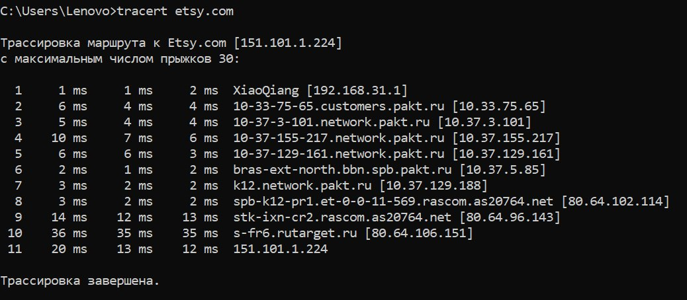 
   - 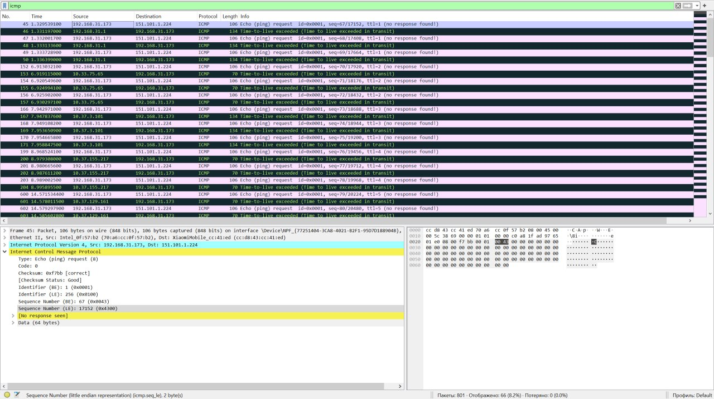 
   - 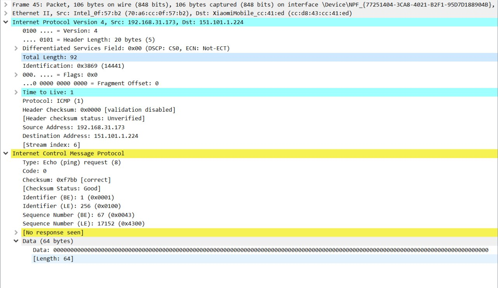 
     - ICMP-заголовок в общем и целом не сильно отличается, разве что добавилось вспомогательное поле `[No response seen]` и поле `Data` больше: $64$ байта вместо $32$ (и теперь заполнено нулями)
     - А вот IP-заголовок отличается: добавилось новое поле `TTL` (числа возрастают от $1$)
2. Рассмотрите на вашем скриншоте ICMP-пакет с сообщением об ошибке. В нем больше полей,
   чем в ICMP-пакете с эхо-запросом. Какая информация содержится в этих дополнительных полях?
   - 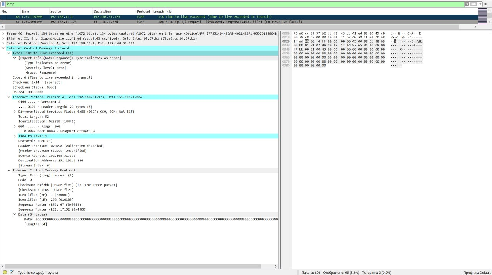 
     - поле `Unused`
     - данные IPv4 
     - ICMP исходного эхо-запроса
3. Рассмотрите три последних ICMP-пакета, полученных исходным хостом. Чем эти пакеты
   отличаются от ICMP-пакетов, сообщающих об ошибках? Чем объясняются такие отличия?
   - 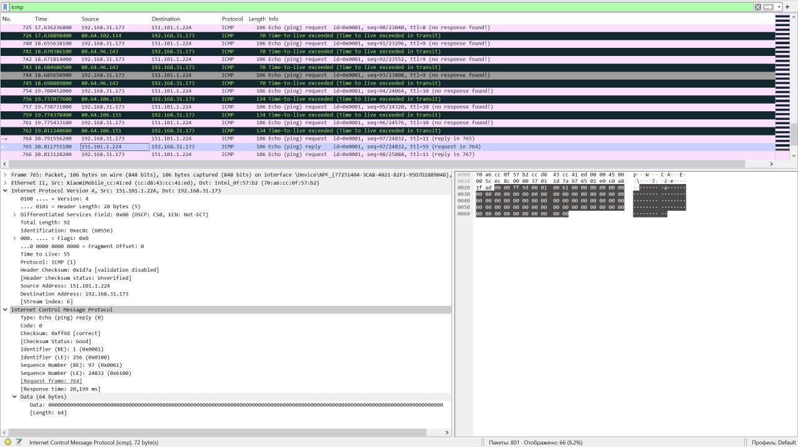 
     - Другой ICMP-тип: `Type: Echo (ping) reply (0)`, а не `Type: Time-to-live exceeded (11)`
     - Нет полей с данными IPv4 и ICMP исходного эхо-запорса

     Такие различия можно объяснить тем, что пакеты дошли до исходного хоста, а не были отправлены обратно маршрутизатором по истечении `TTL` 
4. Есть ли такой канал, задержка в котором существенно превышает среднее значение? Можете
   ли вы, опираясь на имена маршрутизаторов, определить местоположение двух маршрутизаторов,
   расположенных на обоих концах этого канала?
   -  
     - Да, такой канал есть. Наибольший скачок задержки наблюдается между 9-м и 10-м прыжками: среднее RTT возрастает с ~13 мс до ~36 мс
   - 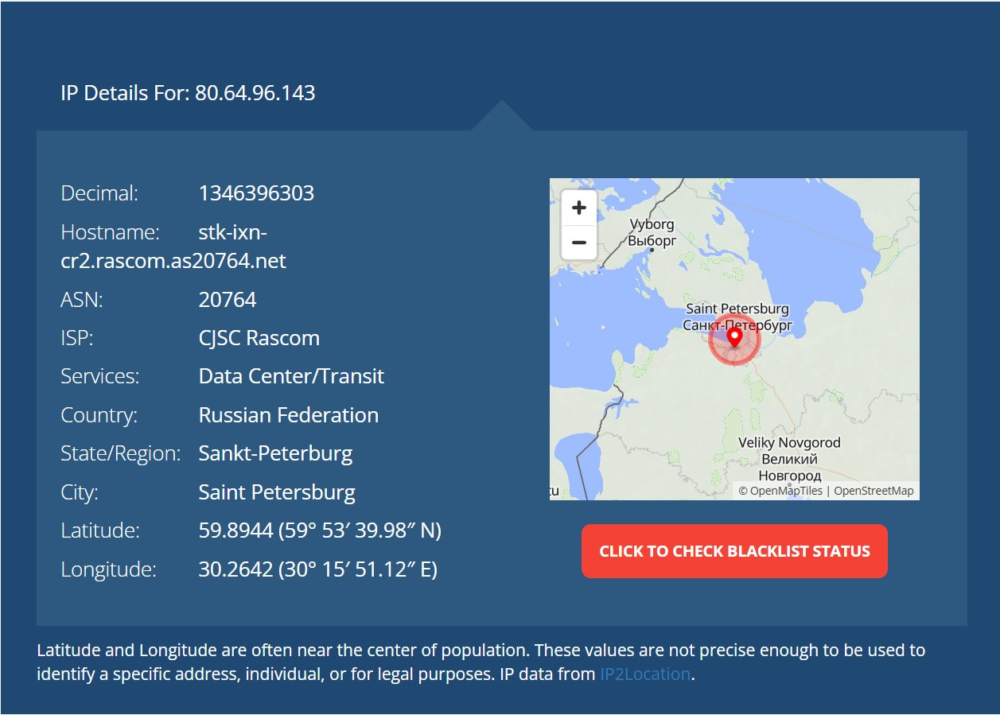 
   - 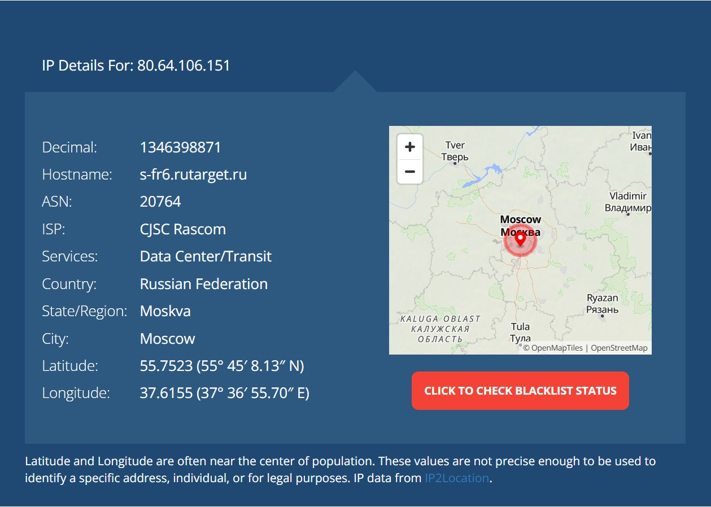 
     - Судя по метоположению, это канал между СПб и Москвой

## Программирование.

### 1. IP-адрес и маска сети (1 балл)
Напишите консольное приложение, которое выведет IP-адрес вашего компьютера и маску сети на консоль.

#### Демонстрация работы
- 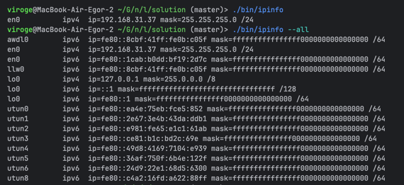 

### 2. Доступные порты (2 балла)
Выведите все доступные (свободные) порты в указанном диапазоне для заданного IP-адреса. 
IP-адрес и диапазон портов должны передаваться в виде входных параметров.

#### Демонстрация работы
- 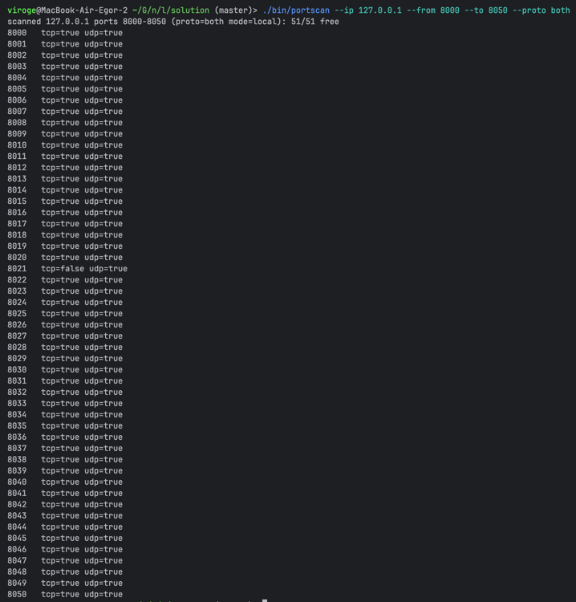 
  - "Свободные" (можно занять) порты локального IP
- 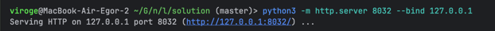 
  - Займем порт `8032`
- 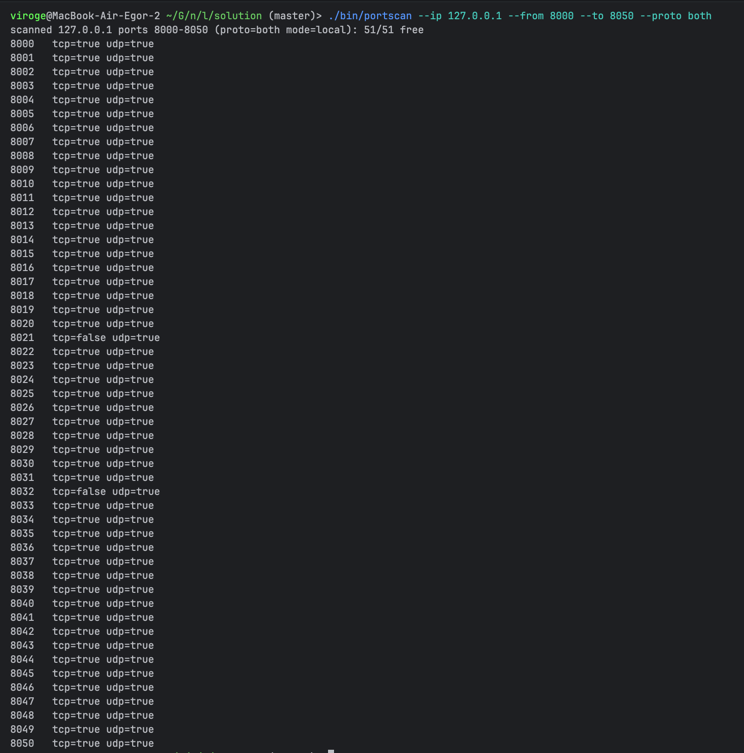 
  - Теперь этот порт занят
- 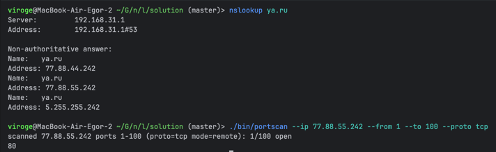 
  - "Свободные" (открытые) порты удаленного хоста

### 3. Широковещательная рассылка для подсчета копий приложения (6 баллов)
Разработать приложение, подсчитывающее количество копий себя, запущенных в локальной сети.
Приложение должно использовать набор сообщений, чтобы информировать другие приложения
о своем состоянии. После запуска приложение должно рассылать широковещательное сообщение
о том, что оно было запущено. Получив сообщение о запуске другого приложения, оно должно
сообщать этому приложению о том, что оно работает. Перед завершением работы приложение
должно информировать все известные приложения о том, что оно завершает работу. На экран
должен выводиться список IP адресов компьютеров (с указанием портов), на которых приложение
запущено.

Приложение считает другое приложение запущенным, если в течение промежутка времени,
равного нескольким интервалам между рассылками широковещательных сообщений, от него
пришло сообщение.

**Такое приложение может быть использовано, например, при наличии ограничения на
количество лицензионных копий программ.*

Пример GUI:

#### Демонстрация работы
- 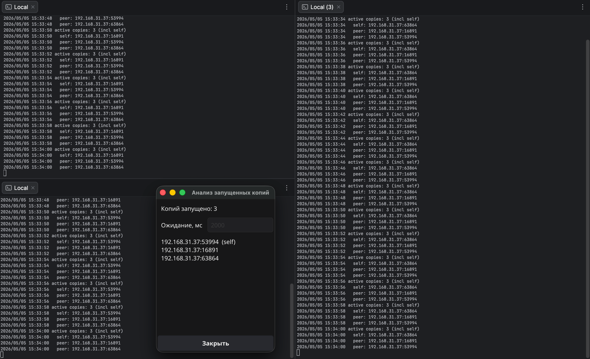 
  - Запустили 3 копии приложения
- 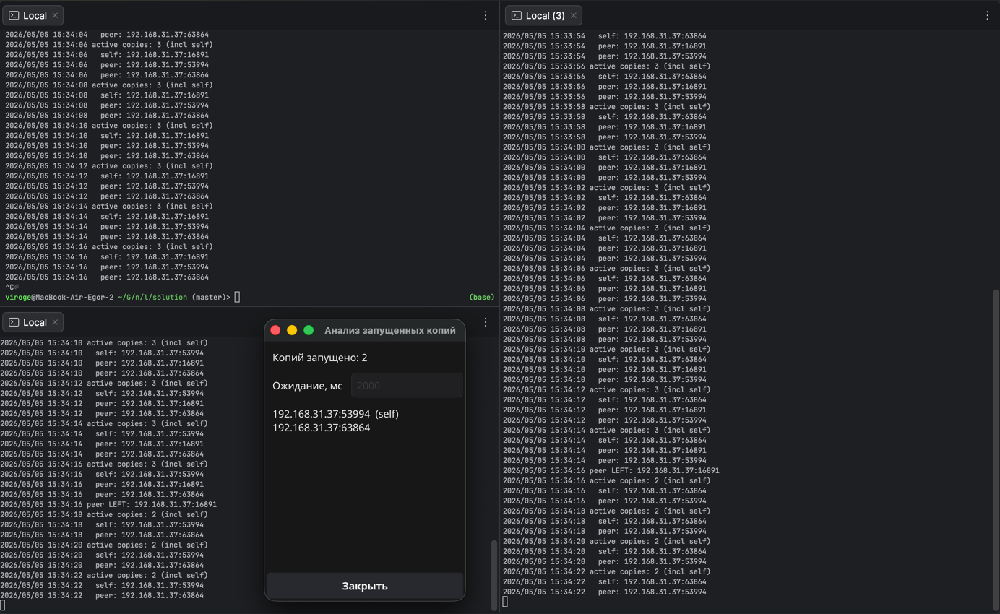 
  - Остановили 1 копию
- 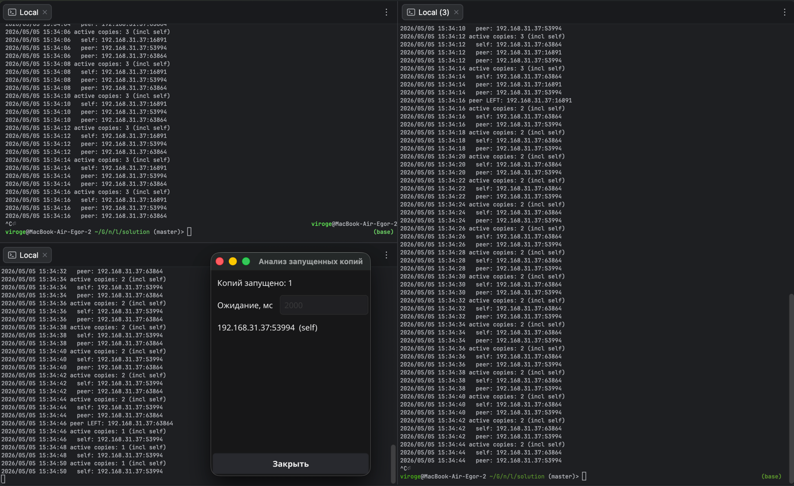 
  - Остановили 2 копии

## Задачи. Работа протокола TCP

### Задача 1. Докажите формулы (3 балла)
Пусть за период времени, в который изменяется скорость соединения с $\frac{W}{2 \cdot RTT}$
до $\frac{W}{RTT}$, только один пакет был потерян (очень близко к концу периода).
1. Докажите, что частота потери $L$ (доля потерянных пакетов) равна
   $$L = \dfrac{1}{\frac{3}{8} W^2 + \frac{3}{4} W}$$
2. Используйте выше полученный результат, чтобы доказать, что, если частота потерь равна
   $L$, то средняя скорость приблизительно равна
   $$\approx \dfrac{1.22 \cdot MSS}{RTT \cdot \sqrt{L}}$$

#### Решение
1. 
   1. С каждым $\text{RTT}$ окно увеличивается на $1$ сегмент. Чтобы оно выросло с $\dfrac{W}{2}$ до $W$, нужно $\dfrac{W}{2}$ шагов  
   2. Тогда всего отправлено пакетов: $S = \sum_{i=0}^{\frac{W}{2}}(\frac{W}{2} + i) \underset{\text{арифм. прог.}}{\overset{\text{сумма}}{=}} \dfrac{3W^2}{8} + \dfrac{3W}{4}$  
   3. $L = \dfrac{\text{# потерянных пакетов}}{\text{# отправленных пакетов}} = \dfrac{1}{S} = \dfrac{1}{\frac{3W^2}{8} + \frac{3W}{4}}$  
2. 
   1. $V_{\text{avg}} = \dfrac{\text{общее число переданных байт}}{\text{время передачи}} = \dfrac{S\cdot\text{MSS}}{(\frac{W}{2} + 1)\cdot\text{RTT}} = \dfrac{(\frac{W}{2} + 1)\cdot\frac{3W}{4}\cdot\text{MSS}}{(\frac{W}{2} + 1)\cdot\text{RTT}} = \dfrac{3W}{4}\cdot\dfrac{\text{MSS}}{\text{RTT}}$
   2. При большом $W$: $\dfrac{3W^2}{8} \gg \dfrac{3W}{4}$
   3. Тогда $L \approx \dfrac{8}{3W^2} \Rightarrow W \approx \sqrt{\dfrac{8}{3L}}$
   4. $\Rightarrow V_{\text{avg}} \approx \dfrac{3}{4}\cdot\sqrt{\dfrac{8}{3L}}\cdot\dfrac{\text{MSS}}{\text{RTT}} \approx \dfrac{1.22}{\sqrt{L}}\cdot\dfrac{\text{MSS}}{\text{RTT}}$

### Задача 2. Найдите функциональную зависимость (3 балла)
Рассмотрим модификацию алгоритма управления перегрузкой протокола TCP. Вместо
аддитивного увеличения, мы можем использовать мультипликативное увеличение. 
TCP-отправитель увеличивает размер своего окна в небольшую положительную 
константу $a$ ($a > 1$), как только получает верный ACK-пакет.
1. Найдите функциональную зависимость между частотой потерь $L$ и максимальным
размером окна перегрузки $W$.
2. Докажите, что для этого измененного протокола TCP, независимо от средней пропускной
способности, TCP-соединение всегда требуется одинаковое количество времени для
увеличения размера окна перегрузки с $\frac{W}{2}$ до $W$.

#### Решение
1. При мультипликативном увеличении за один $\text{RTT}$ окно растёт в $(1+a)$ раз
2. Чтобы окно выросло с $\frac{W}{2}$ до $W$, нужно $n\cdot\text{RTT}$, где:
$$\dfrac{W}{2}(1+a)^n = W \Rightarrow n = \log_{1+a}2$$
3. Общее кол-во сегментов: $S = \frac{W}{2} + \frac{W}{2}\cdot(1+a) + \frac{W}{2}\cdot(1+a)^2 + \dots + \frac{W}{2}\cdot(1+a)^n$, где $n = \log_{1+a}2$
4. Тогда $S = \dfrac{W\cdot(2a+1)}{2a}$
5. Частота потерь: $L = \dfrac{1}{S} = \dfrac{2a}{W\cdot(2a+1)}$
6. Время, требуемое TCP для увеличения окна: $n \cdot \text{RTT} = \log_{1+a}2 \cdot \text{RTT}$ -- это выражение не зависит от $W$ (а значит и от средней пропускной способности, которая пропорциональна $W$)
7. Средняя пропускная способность: $V_{\text{avg}} = \text{MSS} \cdot \dfrac{S}{(n+1)\cdot\text{RTT}}=\dfrac{\text{MSS}}{(n+1)\cdot\text{RTT}}\cdot\dfrac{1}{L}$
